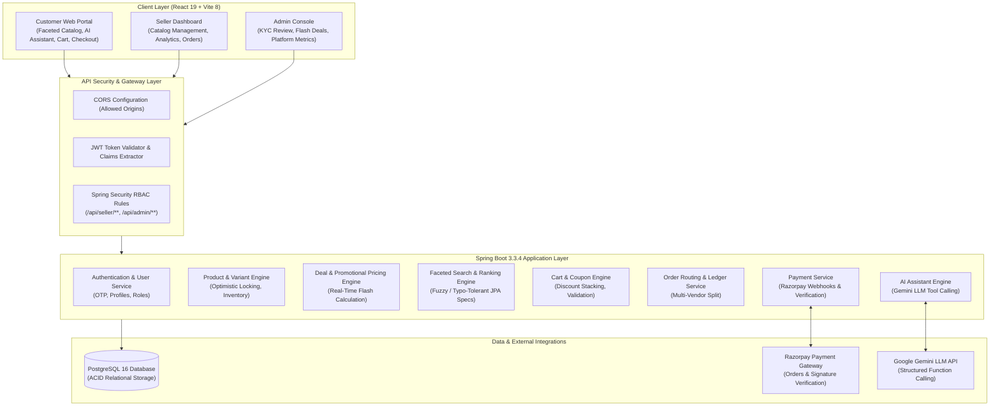

# 🛍️ ShopSphere — Production-Grade Multi-Vendor E-Commerce Platform & Conversational AI Marketplace

[](https://spring.io/projects/spring-boot)
[](https://www.oracle.com/java/)
[](https://react.dev/)
[](https://vitejs.dev/)
[](https://www.postgresql.org/)
[](https://ai.google.dev/)
[](https://tailwindcss.com/)
[](https://razorpay.com/)
[](https://shopsphereecommerceweb.vercel.app/)
[](LICENSE)

> **ShopSphere** is an enterprise-scale, full-stack multi-vendor e-commerce marketplace engineered to mirror production architectures such as Amazon and Flipkart. Built with a decoupled **Spring Boot 3.3 (Java 21)** REST backend and a **React 19 (Vite 8)** single-page application, the platform unifies three dedicated operational portals (**Customer**, **Seller**, and **Admin**) with real-time flash sales, multi-variant inventory concurrency control, and an integrated **Conversational AI Shopping Assistant** powered by Google Gemini.

---

## 📌 Live Demo & Quick Links

| Resource | Link | Description |
| :--- | :--- | :--- |
| **🌐 Production Web App** | [https://shopsphereecommerceweb.vercel.app/](https://shopsphereecommerceweb.vercel.app/) | Live production build deployed on Vercel Edge Network |
| **📖 Swagger OpenAPI Docs** | `http://localhost:5454/swagger-ui/index.html` | Interactive REST API documentation and sandbox testing |
| **📦 GitHub Monorepo** | [https://github.com/yashlodam/ShopSphere-Multivendor_Ecommerce](https://github.com/yashlodam/ShopSphere-Multivendor_Ecommerce) | Single unified monorepo with 100% commit history preserved |

---

## 📑 Table of Contents

- [Key Differentiators & Highlights](#-key-differentiators--highlights)
- [System Architecture](#-system-architecture)
- [Domain Portals & Core Features](#-domain-portals--core-features)
  - [1. Customer Portal](#1-customer-portal-buyer-experience)
  - [2. Seller Portal](#2-seller-portal-vendor-management)
  - [3. Administrator Portal](#3-administrator-portal-platform-governance)
  - [4. Conversational AI Assistant](#4-conversational-ai-shopping-assistant)
- [Senior Technical Engineering Highlights](#-senior-technical-engineering-highlights)
- [Monorepo Directory Layout](#-monorepo-directory-layout)
- [Technology Stack](#-technology-stack)
- [Local Development & Quick Start](#-local-development--quick-start)
  - [Prerequisites](#prerequisites)
  - [Backend Setup](#1-backend-setup-spring-boot-33--java-21)
  - [Frontend Setup](#2-frontend-setup-react-19--vite-8)
- [REST API Specification Matrix](#-rest-api-specification-matrix)
- [Environment Variables Reference](#-environment-variables-reference)
- [Contributing & License](#-contributing--license)

---

## 🌟 Key Differentiators & Highlights

Unlike basic e-commerce clones, ShopSphere addresses real-world distributed commerce challenges:

1. **High-Concurrency Variant Inventory (`@Version` Optimistic Locking)**:  
   Products support arbitrary SKU variants (RAM, Storage, Size, Color). Database-level optimistic locking prevents race conditions and overselling during high-concurrency flash sales.
2. **Authoritative Real-Time Promotional Pricing Engine**:  
   Dynamic price calculation engine enforcing single source of truth across desktop and mobile sticky bottom action bars, eliminating stale price flashes with 0ms visual latency.
3. **Conversational AI Shopping Agent**:  
   Gemini-powered natural language assistant that classifies search intent, extracts typed entities (categories, price ceilings, attributes), and executes structured JPA Criteria queries.
4. **Zero-Flicker Enterprise Frontend UX**:  
   Composite query keys eliminate false "No Products Found" states on initial load and category transitions, paired with Flipkart/Amazon-style shimmer skeletons.
5. **Multi-Vendor Financial Ledger & Order Routing**:  
   Automated multi-vendor order splitting, transaction audit trails, commission deduction, and Razorpay signature verification.

---

## 🏗️ System Architecture



---

## 🏢 Domain Portals & Core Features

### 1. Customer Portal (Buyer Experience)
- **Faceted Product Discovery**: Multi-tier categories, dynamic filters (Brand, Color, Price Range, Discount %, Stock availability), and responsive sorting (Price Low-to-High, High-to-Low, Newest, Ratings).
- **0ms Latency Variant Switching**: Seamlessly toggle between memory/storage/size options with instant price recalculation, active focus rings, and Flipkart-style real-time loading shimmers.
- **Smart Cart & Coupon Engine**: Multi-vendor item aggregation, coupon validation with minimum order value enforcement, and real-time stock guards.
- **Multi-Address Checkout & Payment**: Integrated with Razorpay for secure checkout, payment verification, and automated confirmation receipts.
- **Order Tracking & Lifecycle**: Complete order status state machine (`PENDING` -> `PLACED` -> `CONFIRMED` -> `SHIPPED` -> `DELIVERED` -> `CANCELLED`), order cancellation, and verified star rating/review submissions.
- **Wishlist**: Quick-save favorite items with optimistic UI updates and persistent cross-session synchronization.

### 2. Seller Portal (Vendor Management)
- **Vendor Onboarding & KYC**: Structured registration capturing GSTIN, business details, pickup address, bank account credentials, and verification status workflow (`PENDING_VERIFICATION`, `ACTIVE`, `SUSPENDED`, `BANNED`).
- **Interactive Financial Analytics**: Real-time sales metrics, gross turnover, platform commission fees, and pending balances visualized via Recharts.
- **Inventory & Variant Suite**: Complete CRUD operations for products with independent variant SKU generation, individual stock tracking, custom pricing, and multi-image uploads.
- **Order Fulfillment Pipeline**: Manage order progression with instant customer notification sync.
- **Transaction Ledger**: Complete audit trail of vendor earnings, deductions, and payout settlements.

### 3. Administrator Portal (Platform Governance)
- **Marketplace Analytics**: Platform-wide gross merchandise value (GMV), vendor volume, registered customer metrics, and revenue analytics.
- **Seller Governance**: KYC review workflow, seller approval, suspension, and account termination.
- **Flash Sale & Deal Engine**: Schedule time-bound promotional deals, set discount tiers, upload promotional hero banners, and configure live countdown timers.
- **Coupon Management**: Create promotional coupon codes with usage quotas, discount caps, expiry dates, and order thresholds.
- **Homepage Grid Curation**: Dynamically configure featured home categories, deal-of-the-day carousels, and seasonal banners.

### 4. Conversational AI Shopping Assistant
- **Intent-Driven Architecture**: Powered by Google Gemini with typed function-calling. Accurately distinguishes between `PRODUCT_SEARCH`, `ORDER_STATUS`, `STORE_POLICY`, `CART_INQUIRY`, and `CHITCHAT`.
- **Typed Entity Extraction**: Translates conversational queries (e.g. *"Show me running shoes under 2500"*) into structured parameters: `category: "shoes"`, `keyword: "running"`, `maxPrice: 2500`.
- **Dynamic Catalog Queries**: Maps extracted parameters into JPA Specifications via `ProductRankingService`, ranking candidates by relevance, ratings, and active promotional deals.
- **Contextual Memory & Rate Limiting**: Preserves multi-turn conversation context across sessions while guarding API quotas with token-bucket rate limiting.

---

## ⚡ Senior Technical Engineering Highlights

### 1. High-Concurrency Multi-Variant Inventory Protection
```java
// ProductVariant.java — Optimistic Locking to Prevent Flash Sale Overselling
@Entity
@Table(name = "product_variants")
public class ProductVariant {
    @Id
    @GeneratedValue(strategy = GenerationType.SEQUENCE, generator = "product_variant_seq")
    private Long id;

    @Column(nullable = false)
    private Integer quantity = 0;

    @Version
    private Long version; // Concurrency lock preventing double-spend
}
```
- **The Challenge**: Concurrent shoppers checking out the last unit of a variant during flash promotions can trigger race conditions leading to inventory overselling.
- **The Solution**: Applied JPA Optimistic Locking (`@Version`) within transactional boundaries (`@Transactional`). If two concurrent requests attempt to decrement the final unit, Hibernate detects a version conflict and throws an `OptimisticLockException`, cleanly aborting the collision without locking database rows.

### 2. Real-Time Deal Price Synchronization Across Viewports
```javascript
// ProductDetails.jsx — Unified Authoritative Pricing Derivation
const isDealActive = Boolean(dealPricing?.dealActive);
const isDealPricingMatching = Boolean(
  dealPricing && (selectedVariant?.id ? Number(dealPricing.variantId) === Number(selectedVariant.id) : true)
);

// Frame-0 responsive deal price calculation (0ms visual delay)
const effectivePrice = isDealActive
  ? (isDealPricingMatching && dealPricing?.effectivePrice != null
      ? dealPricing.effectivePrice
      : Math.round(displaySellingPrice * (1 - (dealPricing?.discountPercentage || 0) / 100)))
  : displaySellingPrice;
```
- **The Challenge**: Switching between variants previously caused the price to remain frozen on the old variant's deal price while the network request was in flight, and mobile bottom action bars showed mismatched base prices.
- **The Solution**: Centralized pricing calculations into a single source of truth, implemented frame-0 discount estimation, integrated `AbortController` to cancel in-flight race conditions, and synchronized the middle price section and mobile sticky bottom bar with Flipkart-style real-time loading shimmers.

### 3. Elimination of False "No Products Found" Flashes
- **The Challenge**: Navigating between categories or applying filters momentarily flashed "No Products Found" before the network request resolved.
- **The Solution**: Engineered composite query keys (`${category}|${price}|${color}|${sort}|${page}`). The UI checks `loadedKey === currentKey` synchronously during render. On route transitions, `loadedKey !== currentKey` evaluates to `true` on frame 0, rendering responsive skeleton grids immediately and gating empty state cards strictly behind verified server responses.

---

## 📂 Monorepo Directory Layout

```text
ShopSphere/
├── frontend/                               # React 19 Single-Page Application
│   └── ecommerce_react/
│       ├── src/
│       │   ├── State/                      # Redux Toolkit Slices (Auth, Product, Cart, Orders, Deals)
│       │   ├── customer/                   # Customer Portal Pages (Home, ProductDetails, Cart, Checkout)
│       │   ├── seller/                     # Seller Portal Pages (Dashboard, Inventory, Orders, Ledger)
│       │   ├── admin/                      # Admin Portal Pages (Sellers, Coupons, Deals, Analytics)
│       │   ├── common/                     # Reusable UI (DealPrice, DealBadge, Skeletons, ErrorStates)
│       │   └── config/                     # Axios API instance and interceptors
│       ├── public/                         # Static assets & icons
│       ├── package.json                    # Frontend dependencies (React 19, Tailwind 4, MUI 9, Recharts)
│       ├── vite.config.js                  # Vite 8 build configuration
│       └── vercel.json                     # Vercel SPA routing rewrite rules
│
├── backend/                                # Spring Boot 3.3.4 RESTful Web Services
│   ├── src/main/java/com/zosh/
│   │   ├── config/                         # AppConfig, SecurityConfig, CorsConfig, JWT Provider
│   │   ├── controller/                     # REST Endpoints (Auth, Product, Cart, Order, Deal, Chat)
│   │   ├── model/                          # JPA Entities (User, Seller, Product, ProductVariant, Deal)
│   │   ├── repository/                     # Spring Data JPA Repositories
│   │   ├── service/                        # Business Logic Interfaces
│   │   │   ├── impl/                       # Service Implementations & JPA Specifications
│   │   │   └── ai/                         # Conversational AI Engine (Gemini LLM, Tool Callers, Ranking)
│   │   └── dto/                            # Data Transfer Objects (Pricing, Chat, Orders)
│   ├── pom.xml                             # Maven configuration (Java 21, Spring Boot 3.3.4)
│   ├── Dockerfile                          # Multi-stage production container build
│   └── .env.example                        # Environment variables template
│
└── README.md                               # Root Monorepo Documentation
```

---

## 💻 Technology Stack

| Domain | Technology | Version | Purpose |
| :--- | :--- | :--- | :--- |
| **Frontend Framework** | **React** | `19.2.x` | Modern component UI with concurrent rendering |
| **Build Tool** | **Vite** | `8.0.x` | Sub-second HMR and production bundle optimization |
| **State Management** | **Redux Toolkit** | `2.12.x` | Predictable centralized state management |
| **Styling & UI** | **Tailwind CSS** | `4.3.x` | Modern utility-first responsive styling |
| **Component Suite** | **Material-UI (MUI)**| `9.1.x` | Accessible form controls, modals, and navigation |
| **Data Visualization** | **Recharts** | `3.8.x` | Interactive revenue, sales, and order velocity charts |
| **Backend Core** | **Spring Boot** | `3.3.4` | Enterprise RESTful web services & dependency injection |
| **Language Runtime** | **Java OpenJDK** | `21` | Modern Java LTS runtime with virtual threads support |
| **Security & Auth** | **Spring Security** | `6.3.x` | Stateless JWT authentication & role-based access control |
| **Database ORM** | **Spring Data JPA** | `3.3.x` | Relational mapping, CriteriaBuilder, and dynamic Specs |
| **Database Engine** | **PostgreSQL** | `16.x` | ACID-compliant relational data storage |
| **AI Integration** | **Google Gemini** | `v1beta` | Conversational NLP, intent detection & tool calling |
| **Payment Gateway** | **Razorpay SDK** | `1.4.9` | Order creation, payment capture, webhook verification |
| **API Documentation** | **Springdoc OpenAPI**| `2.6.0` | Swagger UI interactive API documentation |

---

## 🚀 Local Development & Quick Start

### Prerequisites
- **Java Development Kit (JDK)**: Version `21` or higher
- **Node.js**: Version `18.x` or `20.x` LTS
- **PostgreSQL**: Version `15` or `16` running locally or cloud database (e.g. Supabase)
- **Maven**: Version `3.9+` (or use the included `./mvnw` wrapper)

---

### 1. Backend Setup (Spring Boot 3.3 & Java 21)

1. Navigate to the backend directory:
   ```bash
   cd backend
   ```

2. Configure environment variables:
   ```bash
   cp .env.example .env
   ```
   Edit `.env` and configure your database and security credentials:
   ```properties
   DB_URL=jdbc:postgresql://localhost:5432/ecommerce_multivendor
   DB_USERNAME=postgres
   DB_PASSWORD=your_postgres_password
   JWT_SECRET_KEY=your-64-character-production-jwt-secret-key-replace-me!
   RAZORPAY_API_KEY=your_razorpay_key
   RAZORPAY_API_SECRET=your_razorpay_secret
   GEMINI_API_KEY=your_gemini_api_key
   ```

3. Build and launch the backend application:
   ```bash
   # On Linux/macOS:
   ./mvnw spring-boot:run

   # On Windows:
   .\mvnw.cmd spring-boot:run
   ```

4. Verify backend health and documentation:
   - Server Base: `http://localhost:5454`
   - Swagger UI: `http://localhost:5454/swagger-ui/index.html`

---

### 2. Frontend Setup (React 19 & Vite 8)

1. Navigate to the frontend directory:
   ```bash
   cd frontend/ecommerce_react
   ```

2. Install dependencies:
   ```bash
   npm install
   ```

3. Configure frontend environment:
   ```bash
   cp .env.example .env
   ```
   Ensure `VITE_API_BASE_URL` points to your backend:
   ```properties
   VITE_API_BASE_URL=http://localhost:5454
   ```

4. Launch Vite development server:
   ```bash
   npm run dev
   ```

5. Open your browser:
   - Application URL: `http://localhost:5173`

---

## 📊 REST API Specification Matrix

| Category | Method | Endpoint | Description | Auth Required |
| :--- | :--- | :--- | :--- | :--- |
| **Auth** | `POST` | `/auth/signup` | Register new user with email OTP | ❌ Public |
| **Auth** | `POST` | `/auth/signin` | Authenticate and receive JWT token | ❌ Public |
| **Catalog** | `GET` | `/products` | Faceted search with filters & pagination | ❌ Public |
| **Catalog** | `GET` | `/products/{id}` | Product details, ratings & reviews | ❌ Public |
| **Variants** | `GET` | `/products/{id}/variants` | Get purchasable SKU variants & stock | ❌ Public |
| **Deals** | `GET` | `/api/deals/pricing` | Authoritative promotional deal calculation | ❌ Public |
| **AI Assistant** | `POST` | `/api/chat` | Natural language shopping query execution | ❌ Public / User |
| **Cart** | `GET` | `/api/cart` | Get user cart with applied discounts | 🔒 Customer |
| **Cart** | `POST` | `/api/cart/add` | Add variant to cart with stock validation | 🔒 Customer |
| **Orders** | `POST` | `/api/orders` | Create order & initiate payment session | 🔒 Customer |
| **Payments** | `POST` | `/api/payment/{paymentId}`| Verify Razorpay signature & confirm order | 🔒 Customer |
| **Seller** | `POST` | `/api/seller/create` | Vendor onboarding & KYC registration | 🔒 User |
| **Seller** | `GET` | `/api/seller/products` | Retrieve vendor's product inventory | 🔒 Seller |
| **Seller** | `POST` | `/api/seller/products` | Create product with multiple variants | 🔒 Seller |
| **Seller** | `GET` | `/api/seller/reports` | Sales velocity & financial statements | 🔒 Seller |
| **Admin** | `GET` | `/api/admin/sellers` | View all vendors by KYC status | 🔒 Admin |
| **Admin** | `PATCH`| `/api/admin/sellers/{id}/status`| Approve, suspend, or ban vendor | 🔒 Admin |
| **Admin** | `POST` | `/api/admin/deals` | Schedule promotional flash sales | 🔒 Admin |
| **Admin** | `GET` | `/api/admin/analytics` | Marketplace GMV & platform analytics | 🔒 Admin |

---

## ⚙️ Environment Variables Reference

### Backend (`backend/.env`)

| Variable | Required | Default | Description |
| :--- | :---: | :---: | :--- |
| `SERVER_PORT` | No | `5454` | Port for Spring Boot web server |
| `DB_URL` | Yes | — | JDBC connection URL (PostgreSQL) |
| `DB_USERNAME` | Yes | `postgres` | Database username |
| `DB_PASSWORD` | Yes | — | Database password |
| `JWT_SECRET_KEY` | Yes | — | 256-bit cryptographically secure HMAC key |
| `RAZORPAY_API_KEY` | Yes | — | Razorpay merchant key ID |
| `RAZORPAY_API_SECRET` | Yes | — | Razorpay merchant secret key |
| `GEMINI_API_KEY` | Yes | — | Google Gemini API key for AI Assistant |
| `DDL_AUTO` | No | `update` | Hibernate schema strategy (`update`/`validate`) |

### Frontend (`frontend/ecommerce_react/.env`)

| Variable | Required | Default | Description |
| :--- | :---: | :---: | :--- |
| `VITE_API_BASE_URL` | Yes | `http://localhost:5454` | Backend REST API base URL |

---

## 👤 Author & Acknowledgements

- **Developer**: **Yash Lodam**
- **GitHub**: [@yashlodam](https://github.com/yashlodam)
- **Live Project**: [ShopSphere Web](https://shopsphereecommerceweb.vercel.app/)

---

## 📄 License

This project is licensed under the **MIT License** — see the [LICENSE](LICENSE) file for details.
